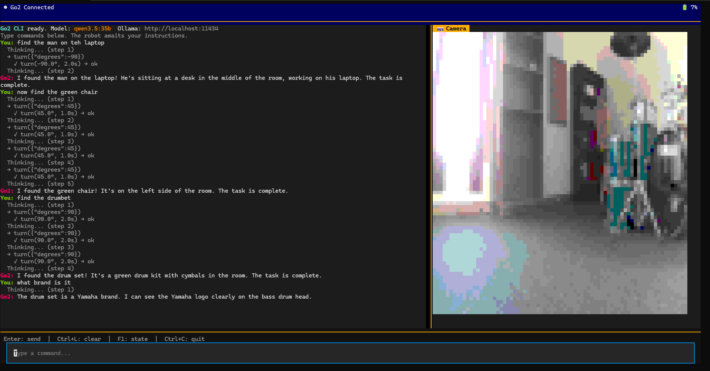

# 🤖 Go2 Agentic Robotics Control

Control your Unitree Go2 robot dog entirely through natural language — no code, no buttons, just type. This toolkit gives you two powerful ways to interact with your robot.

Built on [unitree_webrtc_connect](https://github.com/legion1581/unitree_webrtc_connect) for WebRTC communication. Thanks to [@legion1581](https://github.com/legion1581) for the great library!

> This project was fully written by Claude.ai, Grok, MiniMax M2.5, and Qwen3.5.
> 
> **Disclaimer:** This software controls a real robot. Use at your own risk — I'm not responsible if your Go2 puts a hole in your drywall, trips over your cat, or does anything else dumb.

| Tool | Best For | Interface |
|------|----------|-----------|
| **`go2-mcp`** | AI assistants (OpenWebUI, Claude Desktop) | 50+ MCP tools |
| **`go2-tui`** | Assign tasks — "find the red chair", "go to the kitchen" | Terminal TUI |



---

## Quick Start

Install dependencies:
```bash
uv sync
```

**Option A — Natural Language TUI** (standalone, talks to robot + an LLM provider):
```bash
uv run go2-tui --ip 10.0.0.200 --model qwen3.5:35b
```

**Offline mock mode** (no robot required, simulated state + camera):
```bash
uv run go2-tui --mock
uv run go2-mcp --mock --port 8000
```

**Option B — MCP Server** (for OpenWebUI / Claude Desktop):
```bash
uv run go2-mcp --ip 10.0.0.200 --port 8000
```

Pick one. They are independent.

---

## Two Ways to Control

### 1. MCP Server — AI Agent Integration

A full-featured MCP server exposing 50+ tools for robot control via HTTP (Streamable HTTP) or stdio transport.

**Run (HTTP mode — for OpenWebUI):**
```bash
uv run go2-mcp --ip 10.0.0.200 --port 8000
```
Then configure OpenWebUI: **Admin Panel → Settings → Tools → Add Connection → MCP (Streamable HTTP) → URL: `http://<your-ip>:8000/mcp`**

**Run (stdio mode — for Claude Desktop):**
```bash
uv run go2-mcp --stdio
```

**Available tools (50+):**
- **Movement**: `move(x,y,z)`, `stop()` — displacement-based control with LiDAR obstacle avoidance
- **Stances**: `stand_up`, `stand_down`, `balance_stand`, `recovery_stand`, `sit`, `back_stand`
- **Gaits**: `set_gait(economic|static|trot_run|free_walk|free_bound|free_jump|...)`
- **Body control**: `set_body_height`, `set_foot_raise_height`, `set_speed_level(0-2)`, `set_euler`
- **Social**: `hello`, `show_heart`, `stretch`, `scrape`, `wallow`
- **Dances**: `dance(routine=1|2)`
- **Acrobatics**: `flip(front|back|left|right)`, `handstand`, `front_jump`, `front_pounce`, `wiggle_hips`
- **Motion mode**: `set_motion_mode(normal|ai|obstacle_avoidance)`, `get_motion_mode`
- **Telemetry**: `get_sport_state`, `get_low_state`, `get_multiple_state`, `get_robot_state`
- **VUI**: `set_led_color`, `set_brightness(0-10)`, `set_volume(0-10)`
- **Audio**: `play_radio(url)`, `stop_audio()`, `say(text)` for local TTS playback
- **Sensors**: `lidar_snapshot()` — point cloud + bounding box, `capture_image(quality=1-100)` — base64 JPEG

> **Firmware 1.1.7+ (MCF mode):** The server automatically handles MCF unified mode. Acrobatics work directly — error 7004 is expected and handled gracefully.

---

### 2. CLI — Natural Language TUI

A full-screen terminal UI for conversational robot control with embedded camera feed.

```bash
uv run go2-tui --ip 10.0.0.200 --model qwen3.5:35b
uv run go2-tui --provider openai --model gpt-4.1
uv run go2-tui --provider anthropic --model claude-sonnet-4-5
uv run go2-tui --no-camera  # for headless operation
uv run go2-tui --mock       # offline development
uv run go2-tui -c           # continue the most recent saved chat session
```

**LLM providers:**
- `ollama` (default): native Ollama `/api/chat`, configured with `--ollama`
- `openai-compatible`: any OpenAI-compatible endpoint, configured with `--base-url` and `--api-key`
- `openai`: preset for `https://api.openai.com/v1`, reads `OPENAI_API_KEY`
- `openrouter`: preset for `https://openrouter.ai/api/v1`, reads `OPENROUTER_API_KEY`
- `ollama-openai`: Ollama's OpenAI-compatible `/v1` endpoint
- `lmstudio`: preset for `http://localhost:1234/v1`
- `anthropic` / `anthropic-compatible`: Anthropic Messages API, reads `ANTHROPIC_API_KEY`

**Features:**
- **Live camera feed**: iTerm2/Kitty inline images (Alacritty, WezTerm, iTerm2) or half-block ASCII art fallback
- **Agentic control loop**: Model receives fresh camera frame after every action — it sees what the robot sees and adapts its next move accordingly
- **Thinking mode**: Qwen3/DeepSeek-R1 reasoning visible in real-time
- **Natural language**: "walk forward 1 metre", "turn left 90°", "find the red chair", "do a front flip"
- **Full-state telemetry**: Position, velocity, battery %, orientation (RPY), gait type, LiDAR obstacle distances
- **Autonomous tool calling**: move, turn, stance poses, tricks (flips, dances, waves), LED control, speed adjustment
- **Multi-provider support**: Ollama, OpenAI-compatible APIs, OpenRouter, LM Studio, and Anthropic
- **Multi-model support**: Switch model names on the fly (`model qwen3.5:35b`)
- **Voice/audio**: `Ctrl+M` records from the Go2 microphone, `play_radio` streams audio, `say(text)` speaks via local TTS
- **Mock mode**: Simulated WebRTC, telemetry, camera frames, motion, volume, audio, and speech without powering on the robot
- **Conversation history**: Scrollable chat with rich markup highlighting
- **Slash commands**: Type `/` for command previews like `/sessions`, `/new`, `/resume <id>`, `/model <name>`
- **Saved sessions**: SQLite-backed chat history with `/sessions`, `/new`, `/resume <id>`, and `/rename <id> <title>`
- **Error panel**: Toggleable view for debugging connection/command issues

**Keyboard shortcuts:**
- `Enter` — Send command
- `Ctrl+L` — Clear conversation history
- `Ctrl+E` — Toggle error panel
- `F1` — Print robot state snapshot
- `F2` — Show help screen
- `F3` — View system prompt
- `Ctrl+C` — Quit (safely stops robot first)

**Built-in text commands:**
- `/state` — Print robot state JSON
- `/clear` — Clear conversation
- `/sessions` — List recent saved chat sessions
- `/new` — Start a fresh chat session
- `/resume <id>` — Switch to a saved chat session
- `/rename <id> <title>` — Rename a saved chat session
- `/model <name>` — Switch model on the fly
- `/help` — Show help
- `/prompt` — Show the system prompt

---

## Connection Modes

| Mode | How to Connect | Command Flag |
|------|----------------|--------------|
| **Local AP** (default) | Robot's built-in Wi-Fi | `python script.py` |
| **Local STA** | Connect to robot as station | `--ip 10.0.0.200` or `--serial <SN>` |
| **Remote** | Via Unitree cloud | `--remote --serial <SN> --username <user> --password <pass>` |
| **MCF** (firmware 1.1.7+) | Unified mode — all commands work directly | Automatic |
| **Mock** | Simulated state/camera/audio, no robot needed | `--mock` |

---

## Safety Features

- **Obstacle avoidance guard**: `move()` stops if LiDAR detects obstacles within 0.35m during forward motion
- **Recovery stance**: Use `stance(recovery_stand)` if robot has fallen (pitch/roll > 0.5 rad)
- **Motion mode warnings**: Scripts warn before flips/handstands require clear 2m space
- **Automatic stop on quit**: `Ctrl+C` safely stops and balances robot before exiting
- **Error recovery**: 7004 errors (MCF mode) handled gracefully — no manual intervention needed

---

## Architecture

- **Package layout**: Runtime code lives under `agentic_unitree_go2/`; root `cli.py` and `go2_mcp_server.py` remain as compatibility wrappers
- **Entrypoints**: `go2-tui` launches the Textual app, `go2-mcp` launches HTTP or stdio MCP transport
- **Communication**: WebRTC via `unitree_webrtc_connect` library
- **Shared robot layer**: Connection selection, mock robot, and safety governor are reusable package modules
- **Camera**: VideoTrack streamed via WebRTC, converted to JPEG for display
- **MCP Server**: Implements MCP protocol (list_tools, call_tool, capabilities) for LLM integration
- **TUI**: Textual framework with inline image rendering via terminal escape sequences
- **LLM**: Ollama, OpenAI-compatible APIs, and Anthropic with configurable models
- **Shared**: Error handler patch fixes broken unpacking in unitree_webrtc_connect library

---

## Audio Notes

- `play_radio` streams HTTP audio through the robot speaker.
- `Ctrl+M` in the TUI records from the Go2 microphone, transcribes it with Whisper, and submits it as a normal command.
- `say(text)` uses a local TTS engine (`espeak`, `espeak-ng`, or macOS `say`) when available. In `--mock` mode it reports the spoken text without requiring audio hardware.
